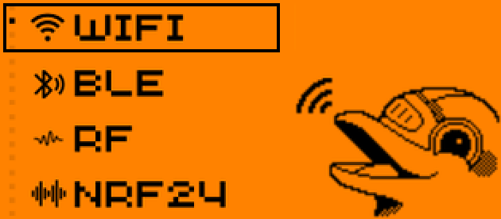
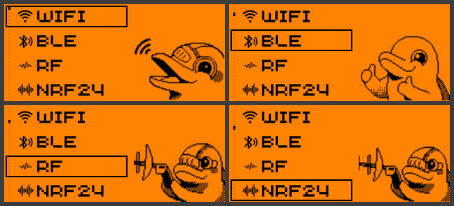
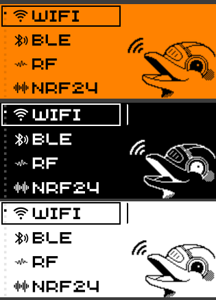
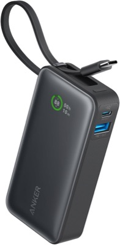

# 🐬 Flipper Bruce Theme — menu réordonné (T-Embed CC1101)

  

> **EN** — This is the excellent **Flipper Bruce** theme by **[anonimoKali](https://github.com/anonimoKali/Bruce-Themes)** (the cyber-dolphin, Flipper-Zero-style list UI) with **one fix**: the on-screen menu list is drawn as a *fake scrolling list* baked into each image, and the original was frozen in a **different order than the real Bruce menu** → the neighbours shown were wrong. Here every frame is **rebuilt to match the real Bruce menu order** on the LilyGO T-Embed CC1101. Same art, correct flow. Three colorways (Classic / Black / White), 4 screen sizes.

Le superbe thème **Flipper Bruce** de **[anonimoKali](https://github.com/anonimoKali/Bruce-Themes)** (le dauphin cyber, UI liste façon Flipper Zero) — **corrigé sur un seul point** : chaque image simule une **liste déroulante** (item sélectionné encadré + voisins), mais l'auteur l'avait figée dans un **ordre différent du menu réel de Bruce** → les voisins affichés étaient faux. Ici **chaque image est reconstruite pour coller à l'ordre réel du menu** sur le **LilyGO T-Embed CC1101**. Même graphisme, bon déroulé.

## 🔧 Ce qui a été corrigé

L'ordre du menu Bruce (T-Embed) est :
**WiFi → BLE → RF → NRF24 → LoRa → FM → IR → Ethernet → GPS → RFID → Files → Scripts → Clock → Others → Config**

L'original listait les voisins dans l'ordre **numérique** des fichiers (`wifi, ble, ethernet, rf, …`), donc en étant sur *WiFi* l'écran annonçait `BLE, ETH, RF` au lieu de `BLE, RF, NRF24`. Chaque image a été **réassemblée** (pagination par 4, comme l'original) avec la **vraie séquence** — le dauphin et les icônes d'origine sont conservés.

| Le curseur descend correctement (page WiFi) | 3 coloris |
|---|---|
|  |  |

> ℹ️ Ce n'était **pas** un bug de molette/firmware : la navigation était correcte, seules les **images** mentaient. Impossible à corriger via le `.json` (c'est du pixel) → on régénère les images.

## 🚀 Installation

1. Choisis ta variante : **Classic** (ambre rétro), **Black** ou **White**.
2. Copie le dossier correspondant sur la **SD** (ou LittleFS). Utilise le sous-dossier **`140px`** pour le T-Embed CC1101 (105/180/192 fournis pour d'autres écrans).
3. Sur l'appareil : **Config → UI Theme → (SD) → sélectionne le `Theme_*.json`**.

## 🛠️ Comment c'est refait

Script [`tools/fix_flipper.py`](tools/fix_flipper.py) (Python + Pillow) : détecte les 4 lignes de la liste, **récolte** la tuile (icône + libellé) de chaque item depuis une image voisine non-encadrée, puis **réécrit chaque PNG numéroté** avec la bonne fenêtre de 4 items + le cadre au bon endroit, en **préservant le dauphin**. Le `.json` reste inchangé (le mapping `wifi=1.png…` est déjà correct).

## 🙏 Crédits & licence

- **Design, dauphin et thème d'origine : [anonimoKali](https://github.com/anonimoKali/Bruce-Themes)** — tout le mérite artistique lui revient.
- **Correction de l'ordre du menu : koua29**.
- Distribué sous **GNU GPLv3** (comme l'original) — voir [LICENSE](LICENSE) et [CREDITS.txt](CREDITS.txt).

## 🛒 Matériel / Hardware

Accessoires utiles pour ce projet — liens affiliés Amazon :

|  |  |  |
|:---:|:---:|:---:|
| 🔋 **[Anker 545 power bank (10 000 mAh)](https://www.amazon.com/dp/B0D45MSMJR?linkCode=ll2&tag=koua29-20&ref_=as_li_ss_tl)** Pour faire tourner le T-Embed loin d'une prise | 📡 **[433 MHz SMA antenna (2-pack)](https://www.amazon.com/dp/B0C1FCZM94?linkCode=ll2&tag=koua29-20&ref_=as_li_ss_tl)** Antenne sub-GHz pour la radio CC1101 | 💾 **[SanDisk 64 GB microSD (2-pack)](https://www.amazon.com/dp/B0B7NVMBPL?linkCode=ll2&tag=koua29-20&ref_=as_li_ss_tl)** Pour les thèmes, scripts et captures Bruce |

En tant que Partenaire Amazon, je réalise un bénéfice sur les achats remplissant les conditions requises. · As an Amazon Associate I earn from qualifying purchases.

## ☕ Un café ?

